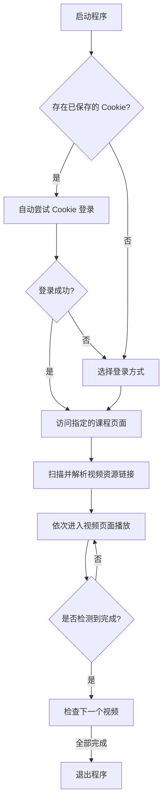

# FlyVedioAssignmentAway!
> SCNU 砺儒云 (Moodle) 视频自动观看工具

基于 Playwright 的自动化脚本，支持自动登录华南师范大学砺儒云系统、解析视频列表并完成自动播放。

## ✨ 功能特点

- ✅ **多种登录方式**: 支持手动输入账号密码登录（推荐）及手动 Cookie 登录
- ✅ **状态自动维护**: 自动检测并刷新登录状态
- ✅ **智能链接解析**: 自动匹配并提取课程中的视频链接
- ✅ **精准播放控制**: 实时检测播放进度，确保视频真正播放完成
- ✅ **断点续播**: 自动处理播放中断，确保流程不间断
- ✅ **可视化进度**: 基于 `rich` 库构建的美化进度条，实时展示剩余时长
- ✅ **多模式支持**: 支持有界面窗口模式或后台无头模式运行
- ✅ **交互式配置引导**: 首次运行自动启动配置向导，无需手动创建 `.env` 文件
- ✅ **专为 SCNU 优化**: 深度适配华南师范大学 Moodle 平台

---

## 🚀 快速开始

### 前置要求

本程序依赖系统中已安装的浏览器，请确保您的电脑上安装了以下任一浏览器：
- **Microsoft Edge** (推荐，已通过完整测试)
- **Google Chrome**

> 理论上 Playwright 支持 Firefox / Safari(Webkit) ，但是这俩用的人都不多，我就懒了，但是也欢迎提交 [PR](https://github.com/YewFence/fly_vedio_assignment_away/pulls)

> 💡 **提示**: 目前主要在 Edge 浏览器上进行开发和测试。若在其他浏览器中遇到异常，欢迎[提交反馈](#-反馈与建议)。
> 
> 本程序已经在 Mac 平台进行过测试(Chrome 浏览器)，可以从源码运行该程序，工作正常，非常感谢帮我进行测试的同学！但由于我没有 Mac 设备，无法进行持续的兼容性测试和维护，因此暂时无法保证 macOS 版本的可执行文件工作始终正常。不过您仍然可以通过[从源码运行](#️-从源码运行)的方式在 macOS 上使用该工具。

### 第一步：下载程序

前往 [Releases](https://github.com/YewFence/fly_vedio_assignment_away/releases) 页面，下载对应系统的可执行文件：
- **Windows**: `fly_video_assignment_away-windows.exe`
- **macOS**：`fly_video_assignment_away-macos.zip`，解压后需在终端中运行（见下方说明），未经充分测试，可能无法工作

> **macOS 用户运行说明参考**
>
> 由于程序未经 Apple 签名，macOS 会阻止直接运行。请按以下步骤操作：
>
> 在下载了 `fly_video_assignment_away-macos.zip` 的目录打开终端，执行以下命令：
> 
> ```bash
> # 1. 解压
> unzip fly_video_assignment_away-macos.zip
>
> # 2. 移除系统隔离属性（绕过 Gatekeeper 拦截）
> xattr -cr fly_video_assignment_away
>
> # 3. 运行
> ./fly_video_assignment_away
> ```
>
> 如果不执行第 2 步，系统会弹出「无法打开，因为无法验证开发者」的提示。此时也可以前往「系统设置 → 隐私与安全性」，找到对应拦截提示并点击「仍要打开」。
> 以上步骤未经过测试，可能无法正常工作，仅供参考。

### 第二步：配置程序

**首次运行时，程序会自动启动配置向导**，引导您完成以下配置：

1. **浏览器类型**: 选择 `msedge` 或 `chrome`（默认 msedge）
2. **无头模式**: 选择是否隐藏浏览器窗口（默认否，推荐新手显示窗口）
3. **课程链接**: 输入您需要观看视频的课程页面 URL

**如何获取课程链接？**
1. 登录 [砺儒云系统](https://moodle.scnu.edu.cn/)
2. 点击进入您需要观看视频的课程页面
3. 复制浏览器地址栏中的完整 URL（类似于 `https://moodle.scnu.edu.cn/course/view.php?id=XXXXX`）

配置完成后，程序会自动创建 `.env` 配置文件，下次启动时会直接使用已保存的配置。

> 💡 **提示**: 如果需要修改配置，可以直接编辑程序目录下的 `.env` 文件，或删除该文件后重新运行程序触发配置向导。

### 第三步：启动程序

直接双击运行程序。

如果未打开无头模式，浏览器会自动启动一个窗口，最小化它即可，该程序会全自动完成所有流程，您不需要也不应该手动操作该浏览器窗口，手动操作窗口可能会出现不可预料的问题

> 不要手动关闭浏览器 / 杀掉进程，否则程序会直接终止

如果已有保存的 Cookie 会自动尝试登录；否则推荐选择「账号密码登录」，在命令行中输入账号密码即可自动完成 SSO 登录，程序随后会自动接管播放流程。

> 请注意：短时间登录错误次数过多账户会被锁定一个小时
> 手动端到端测试登录代码的弊端出现了😢

---

## 🛠️ 从源码运行

如果您熟悉 Python 环境，也可以直接运行源代码：

### 环境要求
- **Python**: 3.13+
- **venv 管理**: 推荐使用 [uv](https://github.com/astral-sh/uv)

### 快速开始 (uv，推荐)
```bash
# 1. 克隆仓库
git clone https://github.com/YewFence/fly_vedio_assignment_away.git
cd fly_vedio_assignment_away

# 2. 安装依赖
uv sync

# 3. 运行（首次运行会自动启动配置向导）
uv run python main.py
```

### 快速开始 (pip + venv)

如果你不想安装 uv，也可以用 Python 自带的 venv + pip：

```bash
# 1. 克隆仓库
git clone https://github.com/YewFence/fly_vedio_assignment_away.git
cd fly_vedio_assignment_away

# 2. 创建并激活虚拟环境
python -m venv .venv
# Windows:
.venv\Scripts\activate
# macOS / Linux:
source .venv/bin/activate

# 3. 安装依赖
pip install .

# 4. 运行（首次运行会自动启动配置向导）
python main.py
```

---

## ⚙️ 工作流程



---

## 🔐 获取登录凭证

### 1. 账号密码登录 (推荐)
启动程序后，选择 `账号密码登录` 模式，在命令行中输入账号和密码。程序会自动完成 SSO 登录并获取砺儒云的会话 Cookie，全程无需手动操作浏览器。登录成功后 Cookie 会自动保存，下次启动时会优先尝试复用。

### 2. 手动获取 Cookies 登录
1. 安装 [Cookie-Editor](https://microsoftedge.microsoft.com/addons/detail/cookieeditor/neaplmfkghagebokkhpjpoebhdledlfi) 扩展。
2. 在浏览器中登录 [SCNU 砺儒云](https://moodle.scnu.edu.cn/)。
3. 点击插件，选择 "Export" 将 Cookies 导出为 **JSON** 格式。
4. 运行程序，选择 `使用您手动获取的 Cookies 登录` 模式，将导出的内容粘贴进程序中。

> [详细 Cookie 获取指南](docs/how_to_get_cookie.md)

---

## ⚠️ 安全与规范

- **隐私保护**: 请妥善保管您的 `.env` 和 `cookies.json` 文件，切勿分享给他人或上传至公开平台。
- **定期更新**: Cookie 具有时效性，若登录失效请重新运行程序使用账号密码登录。
- **合理使用**: 本工具仅用于辅助学习，请确保您的使用行为符合学校相关规定。

---

## ❓ 常见问题 (FAQ)

**Q: 为什么不需要单独下载浏览器驱动？**
A: 本项目基于 Playwright，默认会尝试调用系统中已安装的浏览器，无需手动管理 WebDriver。

**Q: 首次运行需要手动创建 .env 文件吗？**
A: 不需要！程序会在首次运行时自动启动配置向导，引导您完成配置并自动创建 `.env` 文件。这样可以避免 Windows 用户手动创建时可能出现的文件扩展名问题（如误创建为 `.env.txt`）。

**Q: macOS 下载后无法运行，提示「无法验证开发者」？**
A: 这是 macOS Gatekeeper 安全机制导致的。在终端中对可执行文件执行 `xattr -cr fly_video_assignment_away` 即可移除隔离属性，详见上方 [macOS 运行说明](#第一步下载程序)。

**Q: macOS 或 Linux 用户如何配置？**
A: 配置向导会自动适配所有平台。如需手动修改，可以编辑 `.env` 文件中的 `BROWSER` 为 `msedge` 或 `chrome`，并确保系统中已安装相应浏览器。

**Q: 登录状态失效怎么办？**
A: 如果 Cookie 过期，最简单的方法是重新运行程序并选择账号密码登录。

---

## 🚀 反馈与建议
如果您在使用过程中遇到任何问题或有改进建议，欢迎提交 [Issue](https://github.com/YewFence/fly_vedio_assignment_away/issues)。

## 📄 开源协议
本项目基于 [MIT License](LICENSE) 协议开源。

感谢支持！
