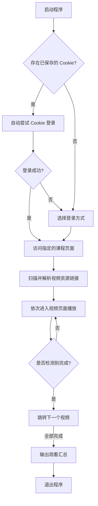

# FlyVideoAssignmentAway

[](https://github.com/YewFence/fly_video_assignment_away/releases)
[](LICENSE)
[](https://github.com/YewFence/fly_video_assignment_away/actions/workflows/ci.yml)

> SCNU 砺儒云 (Moodle) 视频自动观看工具

基于 Playwright 的自动化脚本，支持自动登录华南师范大学砺儒云系统、解析视频列表并完成自动播放。

## ✨ 功能特点

- ✅ **多种登录方式**: 支持账号密码自动登录（推荐）及手动 Cookie 登录
- ✅ **状态自动维护**: 自动检测并刷新登录状态
- ✅ **智能链接解析**: 自动匹配并提取课程中的视频链接
- ✅ **精准播放控制**: 实时检测播放进度，确保视频真正播放完成
- ✅ **断点续播**: 自动处理播放中断，确保流程不间断
- ✅ **可视化进度**: 基于 `rich` 库构建的美化进度条，实时展示剩余时长
- ✅ **多模式支持**: 支持有界面窗口模式或后台无头模式运行
- ✅ **交互式配置引导**: 每次启动运行配置向导，已有配置自动作为默认值，连按回车即可快速启动
- ✅ **专为 SCNU 优化**: 深度适配华南师范大学 Moodle 平台

---

## 🚀 快速开始

### 前置要求

本程序依赖系统中已安装的浏览器，请确保您的电脑上安装了以下任一浏览器：
- **Microsoft Edge** (推荐，已通过完整测试)
- **Google Chrome**

> [!NOTE]
> 理论上 Playwright 支持 Firefox / Safari(Webkit)，但是这俩用的人都不多，我就懒了，但是也欢迎提交 [PR](https://github.com/YewFence/fly_video_assignment_away/pulls)

> [!TIP]
> 目前主要在 Edge 浏览器上进行开发和测试。若在其他浏览器中遇到异常，欢迎[提交反馈](#-反馈与建议)。

### 第一步：下载程序

前往 [Releases](https://github.com/YewFence/fly_video_assignment_away/releases) 页面，根据系统和芯片下载对应文件：
- **Windows**: `fly_video_assignment_away-windows-x86_64.exe`
- **macOS (Apple 芯片，即 M 系列)**: `fly_video_assignment_away-macos-arm64.tar.gz`
- **macOS (Intel 芯片)**: `fly_video_assignment_away-macos-x86_64.tar.gz`
- **Linux**: `fly_video_assignment_away-linux-x86_64.tar.gz`

`.tar.gz` 是为了保留可执行权限（浏览器直接下载裸二进制会丢失执行位），解压后即得到可直接运行的文件，例如 `tar -xzf fly_video_assignment_away-linux-x86_64.tar.gz`。

> [!IMPORTANT]
> **Windows**: 可执行文件未签名，首次双击运行可能被 SmartScreen 拦截并提示「Windows 已保护您的电脑」。点击「更多信息」，再选择「仍要运行」即可。

> [!IMPORTANT]
> **macOS**: 可执行文件未签名未公证，首次运行时系统可能提示「无法打开」或「已损坏」，在终端中移除隔离属性后即可正常运行：
>
> ```bash
> xattr -d com.apple.quarantine fly_video_assignment_away-macos-*
> ```
>
> 我没有 Mac 设备，macOS 可执行文件无法持续测试（从源码运行的方式已有同学验证通过），若不想折腾，直接[从源码运行](#️-从源码运行)也是省心的选择。

> [!WARNING]
> 目前生成的可执行文件发行版（Release）**尚未经过充分测试**，可能存在运行不稳定的情况。
>
> 若您在运行过程中遇到严重问题，建议：
> 1. 跟随指引[从源码运行](#️-从源码运行)，源码已经经过端到端测试
> 2. 欢迎[提交反馈](#-反馈与建议)报告问题，我会~~尽快~~找时间进行修复。


### 第二步：启动并完成配置

直接双击运行程序。**每次启动时，程序都会运行配置向导**，引导您确认以下配置；已有配置会作为默认值，直接回车即可沿用：

1. **浏览器类型**: 选择 `msedge` 或 `chrome`（默认 msedge）
2. **无头模式**: 选择是否隐藏浏览器窗口（默认否，推荐新手显示窗口）
3. **课程链接**: 输入您需要观看视频的课程页面 URL

**如何获取课程链接？**
1. 登录 [砺儒云系统](https://moodle.scnu.edu.cn/)。
2. 点击进入您需要观看视频的课程页面。
3. 复制浏览器地址栏中的完整 URL（类似于 `https://moodle.scnu.edu.cn/course/view.php?id=XXXXX`）。

配置完成后，程序会在当前目录创建（或更新）`.env` 文件，内容无变化时不会重写。下次启动时向导会自动带入这些值，连按回车即可快速启动；也可以直接编辑 `.env`（格式参考 [.env.example](./.env.example)）。

### 第三步：登录并自动播放

如果未开启无头模式，程序会自动打开一个浏览器窗口，最小化即可。整个流程全自动完成，请不要手动操作该窗口，也不要关闭浏览器或结束进程，否则程序会直接终止。

如果已有保存的 Cookie 会自动尝试登录；否则推荐选择「账号密码登录」，在命令行中输入账号密码即可自动完成 SSO 登录，程序随后会自动接管播放流程。

---

## 🛠️ 从源码运行

如果您熟悉 Python 环境，也可以直接运行源代码：

### 环境要求
- **Python**: 3.13+
- **venv 管理**: 推荐使用 [uv](https://github.com/astral-sh/uv)

### 快速开始 (uv，推荐)
```bash
# 1. 克隆仓库
git clone https://github.com/YewFence/fly_video_assignment_away.git
cd fly_video_assignment_away

# 2. 安装依赖
uv sync

# 3. 运行（每次启动都会运行配置向导，回车即可沿用旧配置）
uv run fly-video-assignment-away
```

### 快速开始 (pip + venv)

如果你不想安装 uv，也可以用 Python 自带的 venv + pip：

```bash
# 1. 克隆仓库
git clone https://github.com/YewFence/fly_video_assignment_away.git
cd fly_video_assignment_away

# 2. 创建并激活虚拟环境
python -m venv .venv
# Windows:
.venv\Scripts\activate
# macOS / Linux:
source .venv/bin/activate

# 3. 安装依赖
pip install .

# 4. 运行（每次启动都会运行配置向导，回车即可沿用旧配置）
fly-video-assignment-away
```

---

## ⚙️ 工作流程


```mermaid
graph TD
    A[启动程序] --> B{存在已保存的 Cookie?}
    B -- 是 --> C[自动尝试 Cookie 登录]
    C --> D{登录成功?}
    D -- 是 --> F[访问指定的课程页面]
    D -- 否 --> E[选择登录方式]
    B -- 否 --> E
    E --> F
    F --> G[扫描并解析视频资源链接]
    G --> H[依次进入视频页面播放]
    H --> I{是否检测到完成?}
    I -- 否 --> H
    I -- 是 --> J[跳转下一个视频]
    J -- 全部完成 --> K[输出观看汇总]
    K --> L[退出程序]
```

### 完成判断与进度显示

观看期间会并列显示两条进度条：

- **播放进度**：当前视频在浏览器中的播放位置（本地实时状态）
- **完成度**：平台记录的观看进度，由于平台批量上报（约每 15 秒一批），这条进度会阶梯式增长

信息行中显示的总时长、已观看、剩余、需观看等数据只是估算，**完成判断直接查看平台的完成标记**，读不到标记时才以视频播放完毕为准。

当视频播放到结尾但平台仍显示"未完成"时，程序会等待最多 30 秒让平台更新状态。如果仍未确认，程序会给出警告并跳到下一个视频，避免卡住整个批量。

所有视频处理完成或中途中断（Ctrl+C、关闭浏览器）时，程序会输出观看汇总：

- 平台已确认完成的视频数量
- 已播放到结尾但读不到平台标记的数量
- 未确认完成的视频链接，需要到砺儒云手动确认
- 未处理的视频数量（中断时），重新运行程序可以继续

---

## 🔐 获取登录凭证

### 1. 账号密码登录 (推荐)
启动程序后，选择 `账号密码登录` 模式，在命令行中输入账号和密码。程序会自动完成 SSO 登录并获取砺儒云的会话 Cookie，全程无需手动操作浏览器。登录成功后 Cookie 会自动保存，下次启动时会优先尝试复用。

> [!WARNING]
> 短时间登录错误次数过多会导致账户被锁定一个小时，请确认账号密码无误后再重试。~~别问我怎么知道这事的~~

### 2. 手动获取 Cookies 登录
1. 安装 [Cookie-Editor](https://microsoftedge.microsoft.com/addons/detail/cookieeditor/neaplmfkghagebokkhpjpoebhdledlfi) 扩展。
2. 在浏览器中登录 [SCNU 砺儒云](https://moodle.scnu.edu.cn/)。
3. 点击插件，选择 "Export" 将 Cookies 导出为 **JSON** 格式。
4. 运行程序，选择 `使用您手动获取的 Cookies 登录` 模式，将导出的内容粘贴进程序中。

更多细节参见 [详细 Cookie 获取指南](docs/how_to_get_cookie.md)。

---

## 🔒 隐私与安全

本工具在您的电脑上纯本地运行，不内置遥测或统计上报，除砺儒云及其登录、视频服务外不连接任何地址。

- **不保存账号密码**: 密码仅在内存中用于本次登录，不会写入任何文件；登录成功后只保存会话 Cookie。
- **Cookie 即登录态**: 会话 Cookie 以明文保存在本机 `cookies.json` 中，等同登录凭证。请妥善保管 `.env` 和 `cookies.json`，切勿分享给他人或上传至公开平台。
- **不碰您的浏览器**: 程序以独立临时配置启动新的浏览器实例，不影响您已打开的窗口和日常配置。
- **合理使用**: 本工具仅用于辅助学习，请确保您的使用行为符合学校相关规定。

---

## ❓ 常见问题 (FAQ)

**Q: 为什么不需要单独下载浏览器驱动？**
A: 本项目基于 Playwright，默认会尝试调用系统中已安装的浏览器，无需手动管理 WebDriver。

**Q: 首次运行需要手动创建 .env 文件吗？**
A: 不需要。配置向导会自动创建 `.env`，也就避免了 Windows 上手动创建时误存成 `.env.txt` 的问题。

**Q: 重新运行配置向导会覆盖我的其他配置吗？**
A: 不会。向导只更新 `BROWSER`、`HEADLESS`、`VIDEO_LIST_URL` 三项，保留其他键和注释；内容无变化时也不会重写文件。

**Q: macOS 或 Linux 用户如何配置？**
A: 配置向导在所有平台上都可用。如需手动修改，可以把 `.env` 中的 `BROWSER` 改为 `msedge` 或 `chrome`，并确保系统中已安装相应浏览器。

**Q: 浏览器是 Flatpak 等非标准方式安装的，程序找不到怎么办？**
A: 可以通过 `.env` 或同名环境变量手动指定浏览器：推荐用 `BROWSER_EXECUTABLE_PATH` 直接指向浏览器可执行文件，或用 `CDP_ENDPOINT` 连接自己启动的浏览器。详细配置方法参见[故障排除指南](docs/troubleshooting.md)。

**Q: 登录状态失效怎么办？**
A: 如果 Cookie 过期，最简单的方法是重新运行程序并选择账号密码登录。

---

## 🧰 开发

项目使用 mise 统一管理工具链和可复用任务：

```bash
mise trust
mise install
mise run hooks:install
mise run check
```

完整开发流程参见 [CONTRIBUTING.md](CONTRIBUTING.md)。

---

## 💬 反馈与建议
如果您在使用过程中遇到任何问题或有改进建议，欢迎提交 [Issue](https://github.com/YewFence/fly_video_assignment_away/issues)。

## 📄 开源协议
本项目基于 [MIT License](LICENSE) 协议开源。

感谢支持！
